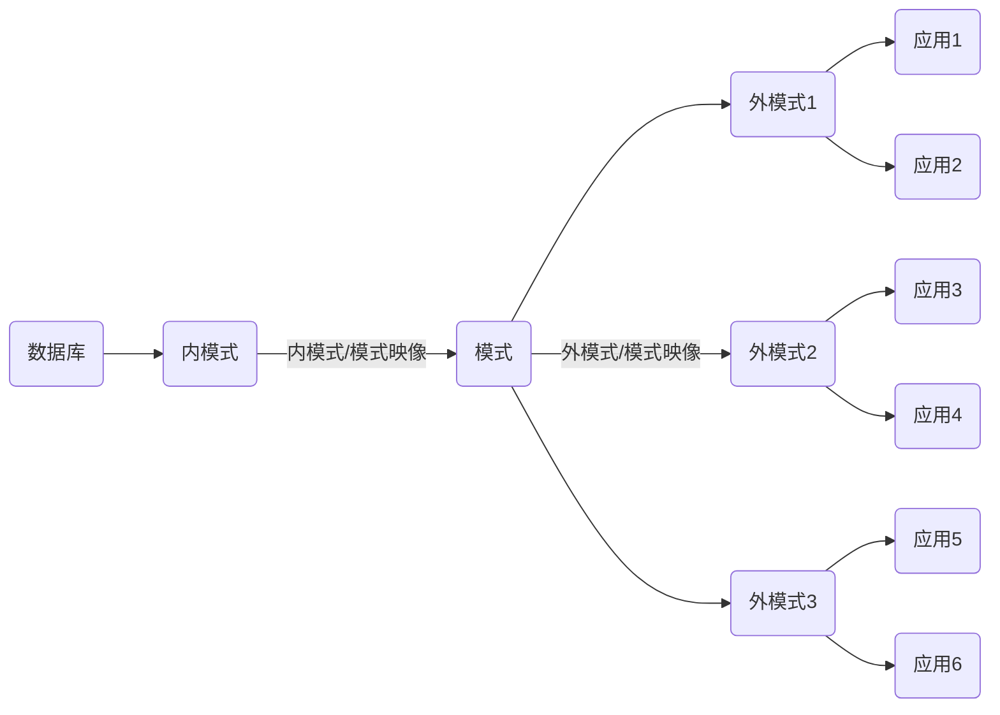

## 数据库系统的结构

在一个DBS中有着不同类型的用户，每个用户都从不同的角度以各自的观点看待数据库，从而形成了DBS不同的视图结构。因此DBS的结构可以有多种不同的层次或不同的视角。
<label>从数据库管理员（DBA）视角来看，DBS分为内部系统结构和外部体系结构，其中内部系统结构通常采用`三级模式结构`，外部体系结构通常表现为 `集中式结构`、`分布式结构`和`并行结构`等；</label>

<label>从数据库用户角度分为客户/服务器结构和浏览器/服务器结构，也就是DBS整体的运行与应用结构</label>

### 三级模式结构

从DBA角度审视数据库系统，其内部基本遵循美国 `ANSI/SPAPRC` DBMS研究组提出的三体系结构（用户、概念级和物理级）。各个DBMS产品在体系结构上通常具有相同的特征（三级模式结构），并提供两层映像功能。DBS三模式结构是指 模式（Schema）、外模式（External Schema）和 内模式（Internal Schema）。

外模式的描述向客户提供数据，内模式的描述存储数据，模式是两者的中间层，机不涉及数据的物理存储和硬件环境，也与具体应用程序、开发工具及设计语言无关。

<h4>模式</h4>
<label>模式也称为概念模式或逻辑模式，是数据库中全体数据的逻辑结构和特征的描述，是所有用户的公共数据视图，即数据在逻辑上的视图（又称概念视图）</label>

DBA必须考虑整个数据库的全局概念视图，它不包含任何的数据库实现细节，如何种D是BMS、文件组织、存取方法及设备特征等；而是定义数据库的逻辑结构、数据之间的联系，及数据相关的安全性、完整性等要求（由DBMS提供模式描述语言（Schema DDL）），同时一个数据库只有有个模式，且相对稳定。

#### 外模式

<label>  外模式也称为子模式（Subschema）或用户模式,是数据库用户能看见和使用的局部数据的逻辑结构和特征的描述，是与某一应用有关数据的逻辑表示。（DBMS提供子模式描述语言（Subschema DDL）来严格定义子模式）
通常其用于满足不同数据库用户需求的数据视图（用户视图），是模式的子集，对数据库整体数据的局部重构。
不同用户在看待数据的方式、应用需求、对数据保密的要求等方面存在差异，对应外模式描述就不同，且模式中同样的数据，在外模式中的结构、类型、长度、保密级别等都可以不同</label>

外模式是保证数据库安全的重要措施，每个用户只能看见和访问所对应的外模式中的数据，简化了DBS的用户接口，便于用户使用，并有效支持数据独立性和共享性。

#### 内模式

内模式也称存储模式（Storage Schema）, 是对数据库中的物理结构和存储方式的描述，是数据在数据库内部的表现形式。是整个数据库的最底层表示，它不同于物理层，是DBA所见到的，特定的DBMS所处理的数据库的内部结构（内部视图或存储视图）。
<label>和模式一样，内模式在一个数据库中只有一个，它不存储设备上的物理记录或物理快，也不涉及任何具体设备限制。</label>

#### 两层映像与数据独立性

总体而言，三个模式的对数据的三级抽象，其特点如下：
- 一个数据库的整理逻辑结构和特征的描述（概念模式）是独立于数据库其他层次结构（内/外模式）的描述，其是数据库的核心，也是数据库设计的关键。