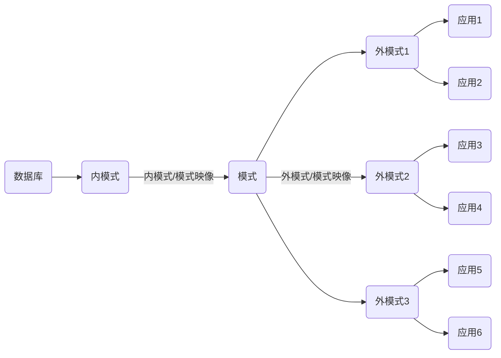

## 数据库系统的结构
> 注：数据库（ DB ）数据库系统（DBS）数据库管理系统（DBMS） 数据库管理员（DBA）
在一个DBS中有着不同类型的用户，每个用户都从不同的角度以各自的观点看待数据库，从而形成了DBS不同的视图结构。因此DBS的结构可以有多种不同的层次或不同的视角。
<label>从数据库管理员（DBA）视角来看，DBS分为内部系统结构和外部体系结构，其中内部系统结构通常采用`三级模式结构`，外部体系结构通常表现为 `集中式结构`、`分布式结构`和`并行结构`等；</label>

<label>从数据库用户角度分为客户/服务器结构和浏览器/服务器结构，也就是DBS整体的运行与应用结构</label>

### 三级模式结构（DBA视角）

从DBA角度审视数据库系统，其内部基本遵循美国 `ANSI/SPAPRC` DBMS研究组提出的三体系结构（用户、概念级和物理级）。各个DBMS产品在体系结构上通常具有相同的特征（三级模式结构），并提供两层映像功能。DBS三模式结构是指 模式（Schema）、外模式（External Schema）和 内模式（Internal Schema）。

外模式的描述向客户提供数据，内模式的描述存储数据，模式是两者的中间层，机不涉及数据的物理存储和硬件环境，也与具体应用程序、开发工具及设计语言无关。

<h4>模式</h4>
<label>模式也称为概念模式或逻辑模式，是数据库中全体数据的逻辑结构和特征的描述，是所有用户的公共数据视图，即数据在逻辑上的视图（又称概念视图）</label>

DBA必须考虑整个数据库的全局概念视图，它不包含任何的数据库实现细节，如何种D是BMS、文件组织、存取方法及设备特征等；而是定义数据库的逻辑结构、数据之间的联系，及数据相关的安全性、完整性等要求（由DBMS提供模式描述语言（Schema DDL）），同时一个数据库只有有个模式，且相对稳定。

#### 外模式

<label>  外模式也称为子模式（Subschema）或用户模式,是数据库用户能看见和使用的局部数据的逻辑结构和特征的描述，是与某一应用有关数据的逻辑表示。（DBMS提供子模式描述语言（Subschema DDL）来严格定义子模式）
通常其用于满足不同数据库用户需求的数据视图（用户视图），是模式的子集，对数据库整体数据的局部重构。
不同用户在看待数据的方式、应用需求、对数据保密的要求等方面存在差异，对应外模式描述就不同，且模式中同样的数据，在外模式中的结构、类型、长度、保密级别等都可以不同</label>

外模式是保证数据库安全的重要措施，每个用户只能看见和访问所对应的外模式中的数据，简化了DBS的用户接口，便于用户使用，并有效支持数据独立性和共享性。

#### 内模式

内模式也称存储模式（Storage Schema）, 是对数据库中的物理结构和存储方式的描述，是数据在数据库内部的表现形式。是整个数据库的最底层表示，它不同于物理层，是DBA所见到的，特定的DBMS所处理的数据库的内部结构（内部视图或存储视图）。
<label>和模式一样，内模式在一个数据库中只有一个，它不存储设备上的物理记录或物理快，也不涉及任何具体设备限制。</label>

#### 两层映像与数据独立性 <label style = "color:red; ">重点</label>
总体而言，三个模式的对数据的三级抽象，其特点如下：
- 一个数据库的整理逻辑结构和特征的描述（概念模式）是独立于数据库其他层次结构（内/外模式）的描述，其是数据库的核心，也是数据库设计的关键。
- 一个数据库的内部存储模式依赖于概念模式，并且独立于外部模式和具体的存储设备。
- 用户逻辑结构（外模式）是在全局逻辑结构描述的基础上定义的，它面向具体的应用程序，独立于内部模式和存储设备。
- 应用程序是在外模式的逻辑结构上编写，依赖于特定的外模式，与数据库的模式和存储结构独立。

<label>用户不必考虑数据的物理存储细节，将其交给DBMS负责管理，同时为有效支撑数据库的三级抽象及它们之前的联系和相互转换，DBMS通过提供两层映像来实现（外模式/模式 和 模式/内模式）</label>

##### 映像
映像是指一种对应规则，指出映像双方如何进行转换。
- 外模式/模式映像：定义各个外模式与概念模式之间的映像关系，这些定义通常在各自的外模式中加以描述。DBS的模式如若发生改变（增加新的关系、属性、改变数据类型等)，DBA会对各个映像做出相应改变，使那些对用户可见的外模式保持不变，从而使程序员不必去修改那些依据数据的外模式所编写的程序，这样外模式就不受模式的影响，保证数据与程序的独立性。
- 模式/内模式：定义数据库全局逻辑结构与物理存储之间的关系，通常在模式中加以描述。而DB只有一个模式，所以此映像是唯一的。同样，DBS 的物理存储如若发生改变（选用另一个存储结构或更换存储位置），DBA会的此映像做出相应调整，使DBS 的模式保持不变，不必修改应用程序，保证的物理独立性

因此，两层映像保证了DBS中的数据具有较高的逻辑独立性和物理独立性，使数据的定义和描述可以从应用程序中分离，简化数据库应用程序的开发，减少维护工作量。

### DBS 的运行与应用结构（用户视角）

#### 客户/服务器结构
 
在DBMS中，DB的使用者（程序员，DBA等）可以使用命令行客户端、图形化界面管理工具、应用程序等连接DBMS，通过DBMS查询和处理存储在底层数据库中的各种数据。<label>那些不与DBMS直接联系的工具和程序被称为`客户端`、`前台`或`表示层`，主要完成交互任务，而DBMS称为`服务器`、`后台`或`数据层`，主要负责数据管理。</label> 这种工作模式就是客户/服务器结构(Client/Server,C/S).

#### 浏览器/服务器结构
此结构基于Web应用的客户/服务器结构，或者三层客户/服务器结构。
在DBS中，它将与DBMS交互的客户端进一步细分为`表示层`和`处理层`。

表示层：指数据库使用者的操作和展示界面，通常由各种浏览器构成
处理层（中间层）：负责处理数据库使用者的具体应用逻辑，与后台的DBMS共同组成功能丰富的`胖服务器` 。

这种工作模式就是浏览器/服务器结构（Browser/Server，B/S）

---

## 数据模型

> 模型是现实世界特征的模拟和抽象表达，帮助人们更好的认识和理解客观事物、对象和过程等感兴趣的内容（飞机航模、建筑图纸、军事沙盘等）。而数据模型是用来模拟和抽象现实世界中的数据特征，描述的是数据的共性内容。

### 数据特征与数据模型组成要素

数据具有静态和动态两种特征。
静态特征：数据的基本结构、数据间的联系及对数据取值范围的约束。
动态特征：指对数据可以进行符合一定规则的操作。
**数据模型通常由数据结构、数据操作和数据约束三要素组成：**
- 数据结构：是描述系统的静态特性，数据对象的类型、内容、属性及数据对象之间的联系。如层次结构、网状结构、关系结构的数据模型分别命名为层次模型、网站模型、关系模型及面向对象模型。
- 数据操作：描述的是系统动态特性，是对各种对象的实例允许执行的操作集合，包括操作及相关的操作规则。主要分为更新（增、删、改）和检索两大类。数据模型必须定义这些操作的确切含义、操作符号、操作规则（优先级等）及实现操作的语言。
- 数据约束：描述数据结构中国数据间的语法和语义关联，包括相互制约与依存关系及数据动态变化规则，保证数据正确性、有效性与相容性。约束包含数据完整性约束、数据安全性及并发控制约束；数据约束既刻画了数据静态特征，也表示了数据动态行为规则。

### 数据模型的分类
**数据模型应满足三个要求：**
1. 能比较真实的模拟现实世界
2. 容易使人们理解
3. 便于在计算机上实现

目前一种数据模型要完全满足三个要求，很困难，因此需针对不同对象和应用，采取逐步抽象的方法，在不同抽象层使用不同的数据模型。

#### 概念层数据模型（数据的概念模型 （Conceptual Model）,信息模型）

概念层是数据抽象级别的最高层，目的是按照用户的观点对世界建模。概念层模型用来描述现实世界的事物，与具体的计算机系统无关，独立于任何DBMS，容易向DBMS所支持的逻辑数据库模型转换，此类模型主要用于数据库的设计阶段，表示现实世界的各个事物及其联系。

 ##### 信息世界中的基本概念（类似于对象）<label style="color:red;">重点</label>
 
概念模型用于信息世界的建模，是现实世界到信息世界的第一层抽象，是数据库设计人员进行数据库设计的有力工具，是设计人员和用户之间交流的语言，因此概念模型具有较强的语义表达能力，能够方便、直接地表达应用中的各种语义知识，它简单、清晰、易于理解。

- 实体（Entity）：客观存在并可相互区别的事物，既可以是实体事物，也可以说抽象的概念或联系（学生、商品、部门、课程、比赛等都可以是实体）
- 属性（Attribute）：实体所具有的某种特性，一个实体可以由多个属性描述（性别，名称、日期，年龄等等）
- 码或键（Key）：可唯一标识实体的属性集。如学生的学号
- 域（Domain）：一个属性的取值范围。如学生实体中姓名的域
- 实体型（Entity Type）：具有相同属性的实体必然具有共同的特征和性质。用实体名于属性名集合抽象和刻画同类实体即实体型。（学号，姓名，性别）
- 实体集（Entity Set）：同实体的集合。（每个学生是一个实体，所以学生组成实体集）
- 联系（Relatinship）：现实世界中，事物内部及事物之间是有联系的，反应到信息世界中即实体（型）内部的联系和实体（型）之间的联系。实体内部的联系通常指各属性之间的联系。如确定学号，即知道对应的姓名，学号与姓名两个属性之间有联系。