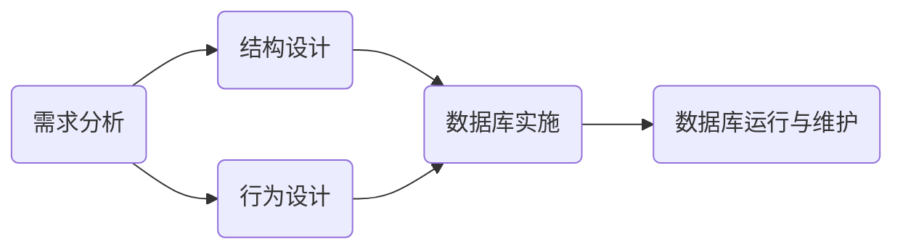

## 概叙

> 针对具体的应用场景，使用现有的 DBMS 构建适合的数据库模式，建立数据库及其应用系统，使之能有效的收集、存储、操作和管理数据，满足实际业务中各类用户的应用需求、信息需求和处理需求，这个过程称为数据库设计。

1.数据库生命周期，从演变过程的角度分为两个阶段：分析与设计阶段 和 实现与操作阶段

1.1 分析与设计阶段细分为四个环节：需求方分析、概念设计、逻辑结构设计和物理结构设计。
1.2 实现与操作阶段细分为3个环节：数据库的实现、操作与监督和修改与调整。

2. 数据库设计主要以满足应用的功能需求和良好的数据库性能为目标。

3. 数据库设计是从用户对数据的需求出发，研究并构造数据库的过程，包括两个方面：数据库结构设计（概念、逻辑和物理结构设计）和行为设计（对数据库的操作）

4. 数据库设计的优劣，会直接影响当前的应用、数据库应用过程中的维护和生命周期，为使数据库设计更加合理，需要一个有效的指导原则（方法），大体分为三类：直观设计法、规范设计法和计算机辅助设计法。

4.1 直观设计法：利用设计者的经验和技巧来设计数据库模式。此方法缺乏科学理论指导，质量很难保证。
4.2 规范设计法：又细分为 新奥尔良设计法、基于 E-R 模型的数据库设计法和基于第三范式的设计方法。
4.2.1 新奥尔良设计法：将数据库设计为四个阶段（需求分析、概念结构设计、逻辑结构设计和物理结构设计，注重结构设计）
4.2.2 E-R模型数据设计法：在需求分析的基础上用E-R图像构造一个反应现实世界实体之间联系的企业模式，然后将模式转换成某一特定 DBMS 下的概念模式。
4.2.3 基于第三范式的设计方法：在需求分析的基础上先确定数据库的模式，属性及属性间的依赖概念性，进行模式分解，规范成若干个第三范式关系模式的集合。

5. 计算机辅助设计方法：以领域专家的知识或经验为主导，模拟某一规范化设计的方法，通常通过人机交互的方式来完成设计的某些过程。

5. 数据库设计的过程六大阶段：需求分析 -> 结构设计（概念、逻辑和物理结构设计）∪ 行为设计（功能、事务和程序设计） -> 数据库实施（加载数据库数据和调试运行应用程序） -> 数据库运行和维护

数据库设计过程实际是一个反复修改、反复设计的迭代过程。

## 数据库设计的基本步骤

### 需求分析

> 需求分析是数据库设计的起点，直接影响后续阶段的设计和数据库系统能否被合理使用。分四个步骤：确定数据库范围、分析数据应用过程、收集与分析数据和编写需求分析报告。
需求分析的目标是了解与分析用户的信息及应用处理的要求，并将结果按一定格式整理形成需求分析报告。

数据库设计人员进行需求分析基本方法：听取数据库应用部们人员的报告，并沟通。同时需求分析人员提交一份需求调查表，该表内容主要包括调查的内容和要求提供资料的格式，应用部门的业务人员可根据该表进行准备和提交材料；此外数据库设计人员还需查阅原始资料，及跟班作业等

#### 确定数据库范围

范围指数据库应支持哪些应用功能。该范围应尽可能的考虑较为广泛的应用部门或领域，充分满足用户的应用功能要求，有效地利用计算机设备及数据库系统的潜在能力。同时还应尽可能考虑将来的应用需求，提高数据库应变能力，避免以后频繁修改。

满足上述要求的数据库是复杂而庞大的，由于诸多因素的影响，设计人员当首先考虑支持用户工作需要所必须的应用要求。

#### 应用过程分析
此过程分析指了解并分析数据与数据处理间的关系。在确定数据库范围后，设计人员应逐次地了解分析每一部门或功能要用到哪些数据、数据的使用顺序、对数据作何处理和处理的策略及处理结果等

过程分析的结果是数据库结构设计的重要依据。

#### 收集与分析数据

 数据收集与分析是指了解并分析数据的组成格式及操作特征，每个数据元素的语义及关系等，并将它们收集起来整理归档。
 可从三个方面展开工作：静态结构、动态结构及数据约束。

##### 静态结构

静态结构指不施加应用操作于其上时数据的原始状况。通过数据分类表和数据元素表来说明

1）数据分类表用于数据的总体描述。对于每一客观存在的具有独立意义的单类数据单位应给出其名称、用途、编制者及使用者等说明：

|数据ID|数据名|用途|主人|用户|来源|去向|存档时间|数据量|
|:-:|:-:|:-:|:-:|:-:|:-:|:-:|:-:|:-:|

2）数据元素表
数据元素表指通常意义下的数据项或属性。数据分类表中的每一类数据的所有数据元素名称、类型、长度、意义及算法等都应在数据元素表中进行详尽说明。格式如下：

|数据ID|数据元素ID|元素名|意义|类型|长度|算法|备注|
|:-:|:-:|:-:|:-:|:-:|:-:|:-:|:-:|