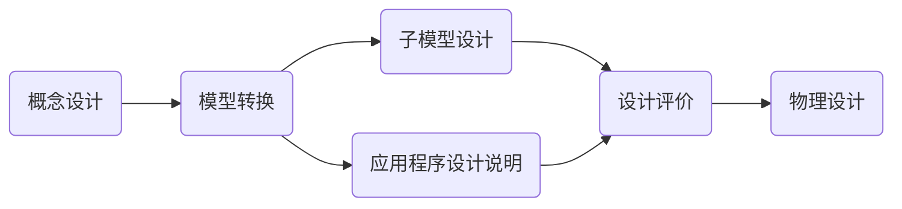

## 概叙

> 针对具体的应用场景，使用现有的 DBMS 构建适合的数据库模式，建立数据库及其应用系统，使之能有效的收集、存储、操作和管理数据，满足实际业务中各类用户的应用需求、信息需求和处理需求，这个过程称为数据库设计。

1.数据库生命周期，从演变过程的角度分为两个阶段：分析与设计阶段 和 实现与操作阶段

1.1 分析与设计阶段细分为四个环节：需求方分析、概念设计、逻辑结构设计和物理结构设计。
1.2 实现与操作阶段细分为3个环节：数据库的实现、操作与监督和修改与调整。

2. 数据库设计主要以满足应用的功能需求和良好的数据库性能为目标。

3. 数据库设计是从用户对数据的需求出发，研究并构造数据库的过程，包括两个方面：数据库结构设计（概念、逻辑和物理结构设计）和行为设计（对数据库的操作）

4. 数据库设计的优劣，会直接影响当前的应用、数据库应用过程中的维护和生命周期，为使数据库设计更加合理，需要一个有效的指导原则（方法），大体分为三类：直观设计法、规范设计法和计算机辅助设计法。

4.1 直观设计法：利用设计者的经验和技巧来设计数据库模式。此方法缺乏科学理论指导，质量很难保证。
4.2 规范设计法：又细分为 新奥尔良设计法、基于 E-R 模型的数据库设计法和基于第三范式的设计方法。
4.2.1 新奥尔良设计法：将数据库设计为四个阶段（需求分析、概念结构设计、逻辑结构设计和物理结构设计，注重结构设计）
4.2.2 E-R模型数据设计法：在需求分析的基础上用E-R图像构造一个反应现实世界实体之间联系的企业模式，然后将模式转换成某一特定 DBMS 下的概念模式。
4.2.3 基于第三范式的设计方法：在需求分析的基础上先确定数据库的模式，属性及属性间的依赖概念性，进行模式分解，规范成若干个第三范式关系模式的集合。

5. 计算机辅助设计方法：以领域专家的知识或经验为主导，模拟某一规范化设计的方法，通常通过人机交互的方式来完成设计的某些过程。

5. 数据库设计的过程六大阶段：需求分析 -> 结构设计（概念、逻辑和物理结构设计）∪ 行为设计（功能、事务和程序设计） -> 数据库实施（加载数据库数据和调试运行应用程序） -> 数据库运行和维护

数据库设计过程实际是一个反复修改、反复设计的迭代过程。

## 数据库设计的基本步骤

### 需求分析

> 需求分析是数据库设计的起点，直接影响后续阶段的设计和数据库系统能否被合理使用。分四个步骤：确定数据库范围、分析数据应用过程、收集与分析数据和编写需求分析报告。
需求分析的目标是了解与分析用户的信息及应用处理的要求，并将结果按一定格式整理形成需求分析报告。

数据库设计人员进行需求分析基本方法：听取数据库应用部们人员的报告，并沟通。同时需求分析人员提交一份需求调查表，该表内容主要包括调查的内容和要求提供资料的格式，应用部门的业务人员可根据该表进行准备和提交材料；此外数据库设计人员还需查阅原始资料，及跟班作业等

#### 确定数据库范围

范围指数据库应支持哪些应用功能。该范围应尽可能的考虑较为广泛的应用部门或领域，充分满足用户的应用功能要求，有效地利用计算机设备及数据库系统的潜在能力。同时还应尽可能考虑将来的应用需求，提高数据库应变能力，避免以后频繁修改。

满足上述要求的数据库是复杂而庞大的，由于诸多因素的影响，设计人员当首先考虑支持用户工作需要所必须的应用要求。

#### 应用过程分析
此过程分析指了解并分析数据与数据处理间的关系。在确定数据库范围后，设计人员应逐次地了解分析每一部门或功能要用到哪些数据、数据的使用顺序、对数据作何处理和处理的策略及处理结果等

过程分析的结果是数据库结构设计的重要依据。

#### 收集与分析数据

 数据收集与分析是指了解并分析数据的组成格式及操作特征，每个数据元素的语义及关系等，并将它们收集起来整理归档。
 可从三个方面展开工作：静态结构、动态结构及数据约束。

##### 静态结构

静态结构指不施加应用操作于其上时数据的原始状况。通过数据分类表和数据元素表来说明

1）数据分类表用于数据的总体描述。对于每一客观存在的具有独立意义的单类数据单位应给出其名称、用途、编制者及使用者等说明：

|数据ID|数据名|用途|主人|用户|来源|去向|存档时间|数据量|
|:-:|:-:|:-:|:-:|:-:|:-:|:-:|:-:|:-:|

2）数据元素表
数据元素表指通常意义下的数据项或属性。数据分类表中的每一类数据的所有数据元素名称、类型、长度、意义及算法等都应在数据元素表中进行详尽说明。格式如下：

|数据ID|数据元素ID|元素名|意义|类型|长度|算法|备注|
|:-:|:-:|:-:|:-:|:-:|:-:|:-:|:-:|:-:|
类型：描述元素的数据特征（字符串、整数型、实数型）

##### 动态结构

动态结构指将应用操作施加于数据之上的数据状况，可通过任务分类表和数据操作特征表进行说明

1）任务分类表
根据对数据流程图的分析，可将业务处理过程划分不同任务。 一个任务指为完成某一特定处理功能的相对独立的操作序列。格式如下：

|任务ID|名称|功能|类型|主人|用户|执行日期|频率|操作过程|备注|
|:-:|:-:|:-:|:-:|:-:|:-:|:-:|:-:|:-:|
类型：输入、查询、制表、统计、修改、删除等

2）数据操作特征表
数据操作特征表用来描述任务和数据之间的关系，包括不同任务对数据执行不同操作的频率。一条任务或数据分类表须建立对应的操作特征表。格式如下：

|任务ID|数据ID|建立|查询|插入|修改|删除|数据量|
|:-:|:-:|:-:|:-:|:-:|:-:|:-:|:-:|

##### 数据约束

数据约束指使用数据时的特殊要求。主要有四个方面：
1. 数据的安全保密性，针对不同类型数据的操作权限。
2. 数据完整性，指数据正确性的约束和验证准则，及一致性保护的要求
3. 响应时间，主要指某些特点应用要求的数据存取时间限制
4. 数据恢复，主要指转储及恢复的时机与范围等

#### 编写需求分析报告

需求分析报告要求包括6个方面（数据库的应用功能目标（明确数据库应用范围及应达到的应用处理功能）、标明不同用户视图范围）、应用处理过程需求说明、数据字典、数据量、数据约束：

#### 需求说明
 1. 要求有数据流程图，反映应用部门原始业务处理的工作流程
 2. 任务分类表，标明不同任务的功能及使用状况
 3. 数据库特征表，标明任务和数据间的联系及不同数据的不同澳洲特征与执行频率
 4. 操作过程说明书，根据流程图、任务分类表及数据特征表等，标明各个任务的主要逻辑执行步骤

#### 数据字典
数据字典是DBS中存储三级结构定义的数据库，通常指数据库系统中各类数据详细描述的集合。功能是存储和检索各种数据描述（元数据），提供对各类数据的集中管理，是一种数据分析、系统设计和管理的有力工具。

数据字典包括数据分类表、数据元素表和各类原始资料（所有单据、报表、文件及设计所需的原始资料，并根据数据分类表的数据ID统一分类编号）。

### 概念结构设计

概念设计结构是在需求分析中产生的需求分析报告基础上按照特定的方法设计满足应用需求的用户信息结构，通常称为概念模型

概念模型独立于任何软件硬件，主要目标是最大限度的满足应用需求，完全不顾忌软件硬件的限制，尤其是DBMS 的限制，它是一个符合用户要求的趋于理想化的信息结构，常用方法有实体分析法（自顶向下）和属性综合法（自顶向上）

### 逻辑结构设计

逻辑模型是将概念模型转换为等价的、并为特定 DBMS 所支持数据模型的结构。主要有层次、网状、关系模型

#### 逻辑模型的输入与输出信息

逻辑模型是在需求分析与概念模型的基础上进行的，主要提供如下输入信息：
1. 独立于特定 DBMS 的概念模型。
2. 有关响应时间、安全保密性、数据完整性及恢复方面的要求说明，包括数据的一致性的规则说明。
3. 数据量及使用频率
4. 特定 DBMS 特性，包括其支持的数据模型及数据定义语言的说明。

输出信息：
1. 一个特定 DBMS 支持的模式（概念模式）
2. 一个或多个外部视图（子模式）
3. 物理设计说明，主要有存入数据库中的数据量、使用频率及响应时间要求
4. 程序设计说明，在需求分析的基础上，根据逻辑模型，编制各程序名、执行逻辑步、存取数据的名、顺序及操作特征（读、写、改、删）的说明。

#### 逻辑结构设计的步骤

1. 模型转换：将概念模型等价转换为特定 DBMS 支持的关系、层次或网站模型
2. 子模式设计的目标是抽取或导出模式的子集，以构造不同用户使用的局部数据逻辑结构
3. 应用程序说明是为可实际运行的应用程序设计提供依据与指导，作为设计评价的基础
4. 设计评价任务是分析并检验模式及子模式的正确性与合理性。

### 物理设计
物理设计指对于一个给定的数据库逻辑结构，研究并构造物理结构的过程，主要是确定数据库在存储设备上的存储结构及存储方法， 因 DBMS 不同可能包括建立索引和聚集等待。

### 数据库实施

本阶段需要完成 加载数据、应用程序设计和数据库试的运行工作

加载数据：将符合要求的初始数据装载到数据库中，包括数据的收集、分类、整理校验和输入等过程

### 数据库运行和维护

经过试运行后，确认系统无故障或暂未发现故障时，系统才可投入生成实际中运行，随着应用的深入和拓展，可能会暴露原未发现的问题，也有可能对数据的不断增、删、改使系统的物理结构变坏或存取效率下降，或者需要拓展应用功能，这些都需要开发人员做好维护工作。

