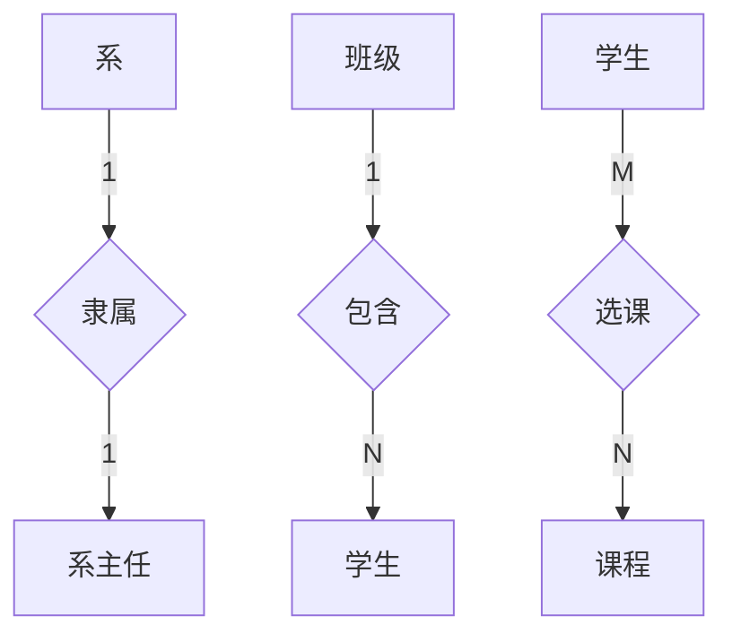
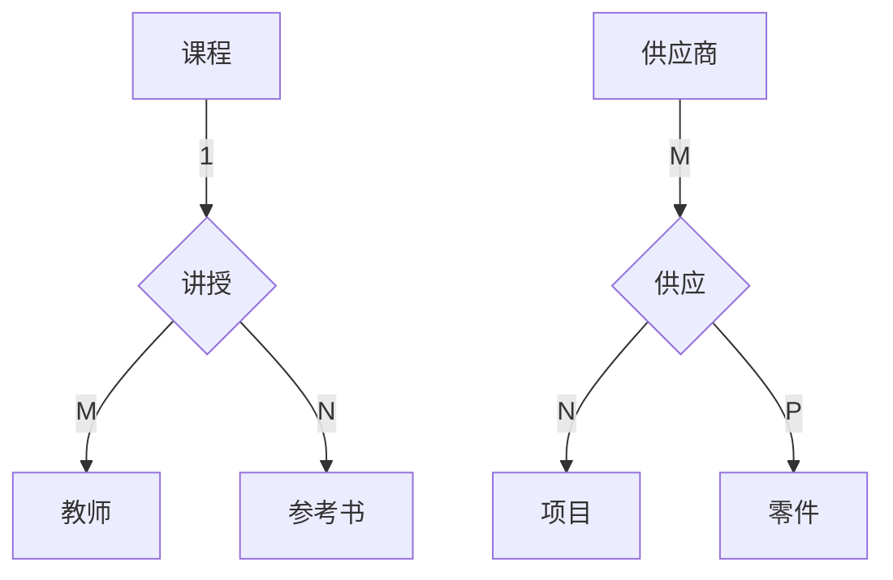
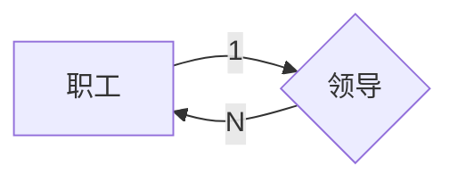

## 概念结构设计方法（概念模式）

概念模式通常采取自顶向下法（实体分析法），通过两个步骤完成概念设计：1.建立局部信息结构 2.将局部信息合并为全局信息结构并优化，使用 E-R 模型作为概念模型的描述工具

### E-R 图的表示方法

概念结构设计是将需求分析得到的用户需求抽象为信息结构（概念模型）的过程，通常使用E-R图作为建模工具具体由三部分组成：
1. 实体型：用矩形表示，矩形内写明实体名称
2. 属性：用椭圆表示，用无向边将其与响应实体连接起来
3. 联系：用菱形表示，菱形内写明联系的名称，并用无向边分别和有关实体连接，同时无向边旁备注联系类型，如果联系也有属性，则同样使用无向边连接。

#### 实体间的联系

实体间的联系通常指不同实体型的实体集直接的联系 由三种联系

##### 两个实体型之间的联系

设两个实体集 A、B，两个实体型间的联系可分为 一对一、一对多、多对多

1> 一对一（1:1）

对于 A 中每一天实体， B 中最多有一个与之联系，反之亦然，则 A与B 记为 1:1

2> 一对多（1:N）
对于 A 中每一个实体，B 中有N个实体与之联系，反之，B的每一个实体，A中至多有一个实体与之对应，则记为 1:N

3> 多对多（M:N）

对于 A 中每个实体，B 中有N个实体与之联系，反之 B 中每个实体，A 中有M个实体与之联系，记为 （M:N）

**example：**

##### 两个实体以上的实体型之间的联系

同两个实体之间的联系一样存在以上三种联系

**example：**

##### 单个实体型内的联系

同一个实体集内的各实体间也可以存在以上三种联系

**example：**

### 局部信息结构设计

局部信息结构设计：根据需求分析报告中标明的不同用户视图范围所建立的满足该范围内用户需求的信息结构。通常为五个步骤

#### 确定局部范围

主要依据需求分析报告中标明的用户视图范围来确定局部范围；基本准则：部门和功能相对独立，同其他局部范围相互影响较小，且实体个数适量。

#### 选择实体

在确定的局部范围内选择一些合适的信息单位作为局部信息结构的基本实体

#### 选择实体的关键字属性

实体的存在依赖于关键字的存在。关键字属性确定后，实体的非关键字就易于确定了。

#### 确定实体间联系

数据间的联系必须在概念设计时确定。
分析实体间是否存在联系的方法：将局部范围内的实体逐一取出与该范围内的其他实体试行匹配，能否找到与两个参加试匹配的实体都有关的问题或同一任务同时使用到参与试匹配的两个实体，存在则它们之间存在联系。

#### 确定实体属性

属性分为标识属性和说明属性两类。
标识属性作用实体的关键字，说明属性作用描述实体的一般特征

确定说明属性的基本原则: 说明属性的存在和使用依赖于标识属性。值为单值，不允许嵌套属性和重复组的现象出现在实体中。

### 全局信息结构设计

将所有局部信息结构合并为一个全局信息结构。其必须是所有局部信息结构的全面准确的映像，形成的全局信息结构仍能实现各局部信息结构能实现的需求

合并是在假设各局部信息结构都说完全一致的前提下进行，即各局部信息结构能满足对于的需求，其内部不存在需要合并的成分。

由于局部信息结构仅以满足局部应用需求为目标，各个局部信息结构对同一数据对象因各自应用特征不同而可能采取不同处理，及每个开发人员对数据语义理解的差别等待，合并中会出现各种各样的冲突，需要合理的解决冲突才能进行合理的合并产出一个合理的全局信息结构。因此合并是一个不断发现和解决冲突的过程。

#### 冲突的种类

##### 属性冲突

属性值域的冲突，如属性值的类型、取值范围、取值集合的不同
属性取值单位冲突，如某个属性有的值用 M 为度量单位，有的用 CM 为度量单位

##### 命名冲突

同名异义：不同意义的实体类型或联系类型名在不同的局部应用中具有相同的名字
异名同义: 相同意义的实体类型或联系类型名在不同局部应用中具有不同的名字

#### 结构冲突

同一对象在一个局部E-R图中作为实体，在另一个局部E-R途中作为属性
同一实体在不同E-R图中属性个数和类型不同
实体之间的联系在不同的E-R图中是不同的类型

#### 解决方法

对于属性、命名冲突，通常采用讨论、协商等行政手段解决
对于结构冲突，须通过认真分析，采用技术手段加以解决

一个好的全局E-R模型除能反映用户功能需求之外，实体类型个数尽可能少，实体类型所含属性尽可能少，实体间联系无冗余。

全局E-R模型的优化可通过上述三个条件来完成

## 逻辑结构设计方法

逻辑结构设计是将概念模型转换为具体的 DBMS 所支持的逻辑数据模型，即将E-R图转换为关系模型、对关系数据模型进行优化、设计面向用户的外模式。

### E-R图转换为关系模型

#### 转换原则

- 一个实体型转换为一个关系模式。实体的属性转换为关系的属性，实体码作为关系码

- 一个一对一（1:1）联系转换为一个独立的关系模式，可与任意一端对应的关系模式合并。该联系相连的各实体码及联系本身的属性转换为关系的属性，每个实体码为关系候选码

- 一个一对多（1:N）联系转换为一个独立关系模式，可与N端对应的关系模式合并。同样相连的各实体码及联系本身属性均转换为关系的属性，关系的码为N端实体的码

- 一个多对多（M:N）联系转换为一个关系模式，与该联系相连的各实体码及联系本身的实现转换为关系属性，关系的码为各个实体码的组合

- 三个及三个以上实体间的一个多元联系转换为一个关系模式。与该多元联系相连的实体码及联系本身的属性转换为关系的属性，关系码为各个实体的组合

- 相同码的关系模式可合并

### 数据模型的优化

关系数据模型的优化通常参考关系规范化理论

#### 优化方法

- 确定各属性间的函数依赖关系
- 对于各关系模式之间的数据依赖进行极小化处理，消除冗余的联系。
- 判断每个关系模式的范式，根据实际需要确定最合适的范式
- 按需求分析阶段得到的处理要求，分析模式对于应用环境是否合适，去掉是否要对某些模式进行合并或分解

### 设计用户子模式

将概念模型转换为全局逻辑模型后，可根据局部应用需求，利用视图设计更符合局部用户需要的用户外模式
定义数据库全局模式主要从系统时间效率、空间效率、以为会角度出发，用户外模式与模式是相对独立的，因此外模式可注重考虑用户的习惯于方便。
- 可通过视图机制在设计用户视图时，重新定义某些属性的别名
- 可对不同级别的用户定义不同的视图，保证系统安全性
- 简化用户对系统的使用。

## 物理设计方法

- 建立索引，通过 DBMS 提供的有关命令实现（有静态（频率高才用）和动态两种方式）

- 建立聚集，将相关数据集中存放的物理存储技术

