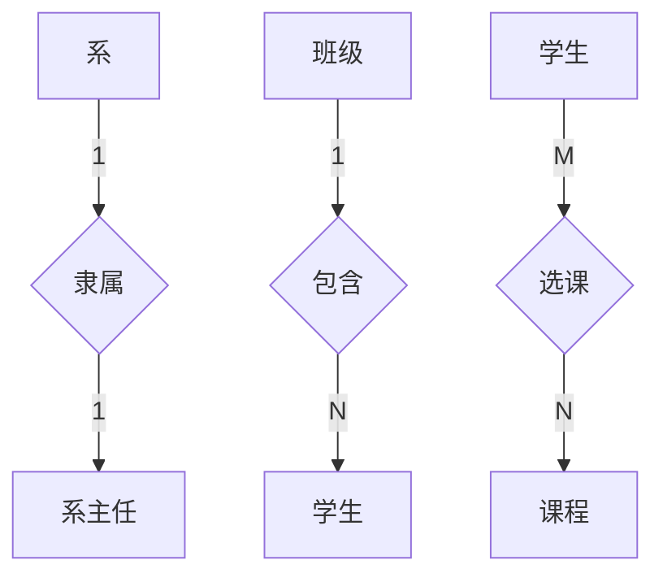
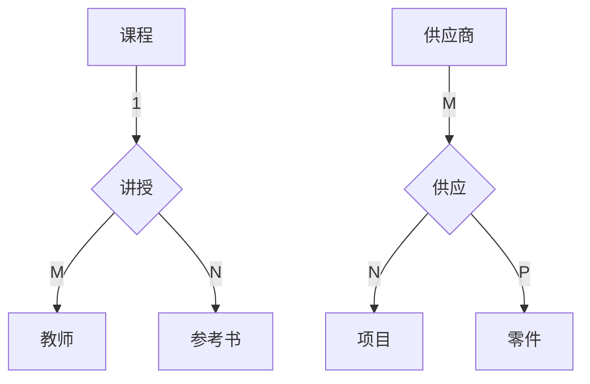
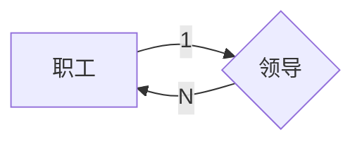

## 概念结构设计方法（概念模式）

概念模式通常采取自顶向下法（实体分析法），通过两个步骤完成概念设计：1.建立局部信息结构 2.将局部信息合并为全局信息结构并优化，使用 E-R 模型作为概念模型的描述工具

### E-R 图的表示方法

概念结构设计是将需求分析得到的用户需求抽象为信息结构（概念模型）的过程，通常使用E-R图作为建模工具具体由三部分组成：
1. 实体型：用矩形表示，矩形内写明实体名称
2. 属性：用椭圆表示，用无向边将其与响应实体连接起来
3. 联系：用菱形表示，菱形内写明联系的名称，并用无向边分别和有关实体连接，同时无向边旁备注联系类型，如果联系也有属性，则同样使用无向边连接。

#### 实体间的联系

实体间的联系通常指不同实体型的实体集直接的联系 由三种联系

##### 两个实体型之间的联系

设两个实体集 A、B，两个实体型间的联系可分为 一对一、一对多、多对多

1> 一对一（1:1）

对于 A 中每一天实体， B 中最多有一个与之联系，反之亦然，则 A与B 记为 1:1

2> 一对多（1:N）
对于 A 中每一个实体，B 中有N个实体与之联系，反之，B的每一个实体，A中至多有一个实体与之对应，则记为 1:N

3> 多对多（M:N）

对于 A 中每个实体，B 中有N个实体与之联系，反之 B 中每个实体，A 中有M个实体与之联系，记为 （M:N）

**example：**

##### 两个实体以上的实体型之间的联系

同两个实体之间的联系一样存在以上三种联系

**example：**

##### 单个实体型内的联系

同一个实体集内的各实体间也可以存在以上三种联系

**example：**

### 局部信息结构设计

局部信息结构设计：根据需求分析报告中标明的不同用户视图范围所建立的满足该范围内用户需求的信息结构。通常为五个步骤

#### 确定局部范围

主要依据需求分析报告中标明的用户视图范围来确定局部范围；基本准则：部门和功能相对独立，同其他局部范围相互影响较小，且实体个数适量。

#### 选择实体

在确定的局部范围内选择一些合适的信息单位作为局部信息结构的基本实体

#### 选择实体的关键字属性

实体的存在依赖于关键字的存在。关键字属性确定后，实体的非关键字就易于确定了。

#### 确定实体间联系

数据间的联系必须在概念设计时确定。
分析实体间是否存在联系的方法：将局部范围内的实体逐一取出与该范围内的其他实体试行匹配，能否找到与两个参加试匹配的实体都有关的问题或同一任务同时使用到参与试匹配的两个实体，存在则它们之间存在联系。

#### 确定实体属性

属性分为标识属性和说明属性两类。
标识属性作用实体的关键字，说明属性作用描述实体的一般特征

确定说明属性的基本原则: 说明属性的存在和使用依赖于标识属性。

